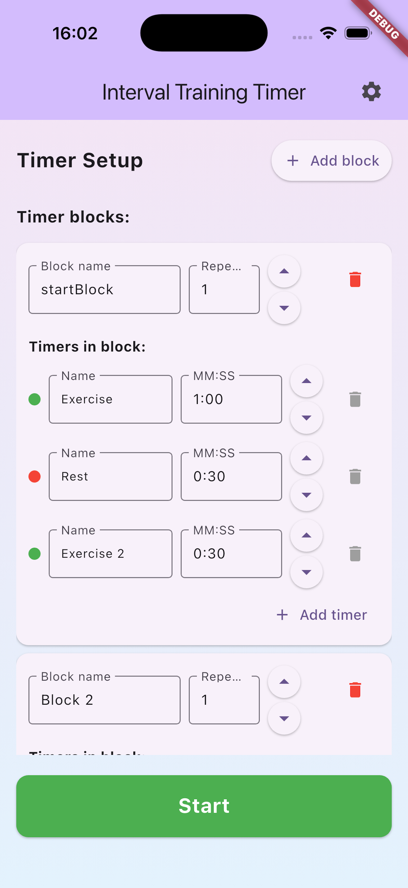
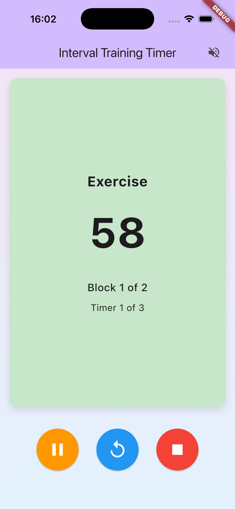
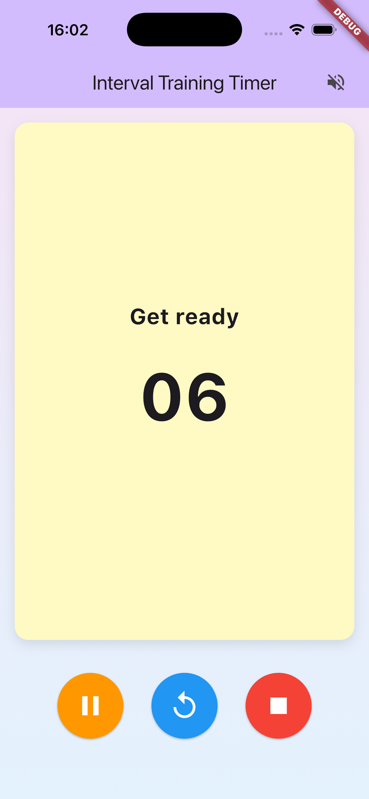
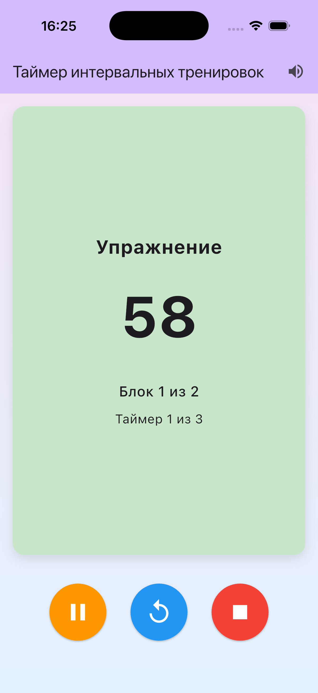
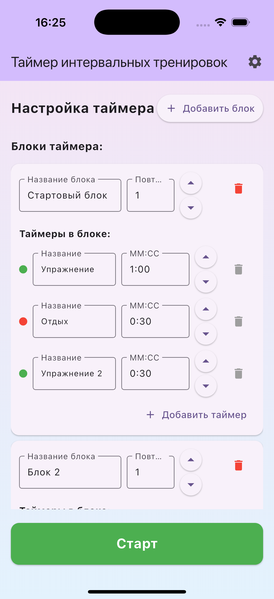

# FitTimer — simple interval training timer

A minimal cross‑platform interval training timer built with Flutter.
This repository contains a standard Flutter project with app sources and platform files.

## Features
- Configure a sequence of blocks and items (exercise/rest)
- 5‑second preparation pause with a single cue at 00
- Audio cues: finish and mid‑point of long intervals
- Material UI with Material 3 support

## Screenshots

## Quick Start
- Install Flutter SDK.
- Run `flutter pub get`.
- List devices: `flutter devices` and start: `flutter run -d <deviceId>`.

## Audio
Uses `audioplayers` and generated WAV for playback.
On web, audio may require a user gesture due to autoplay policies.

## Structure
- `lib/` — app sources (pages, timer logic, audio)
- `pubspec.yaml` — dependencies and metadata
- `docs/` — screenshots and documentation

## Help
Common platform‑specific notes and troubleshooting are in `HELP.md`.

----

# FitTimer — простой таймер интервальных тренировок

Минимальный кроссплатформенный таймер интервальных тренировок на Flutter.
Репозиторий содержит стандартный Flutter‑проект с исходниками приложения и платформенными файлами.

## Возможности
- Настройка последовательности блоков и элементов (упражнение/пауза)
- Подготовительная пауза 5 секунд с одним сигналом на 00
- Звуковые сигналы: завершение и середина длинных интервалов
- Материальный интерфейс, поддержка Material 3

## Скриншоты

## Быстрый старт
- Установите Flutter SDK.
- Выполните `flutter pub get`.
- Посмотрите устройства: `flutter devices` и запустите: `flutter run -d <deviceId>`.

## Звук
Используется `audioplayers` и генерация WAV. На web воспроизведение может требовать
пользовательское действие из‑за политик автоплея.

## Структура
- `lib/` — исходники приложения (страницы, логика таймера, звук)
- `pubspec.yaml` — зависимости и метаданные
- `docs/` — скриншоты и документация

## Помощь
Замечания по платформам и типичные решения — в `HELP.md`.
